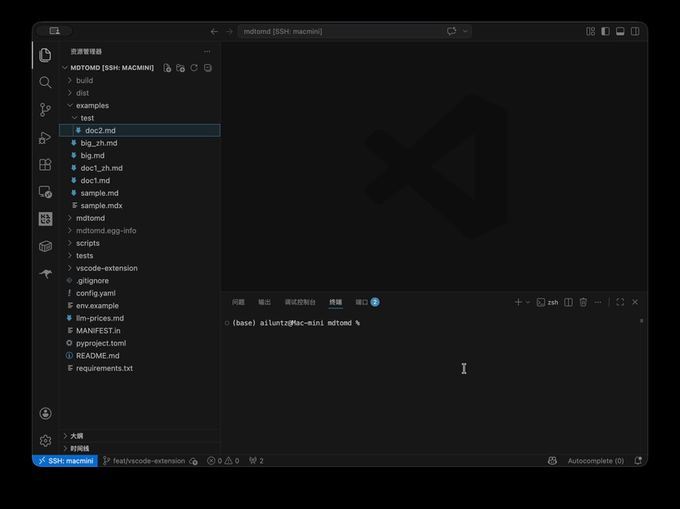

# mdtomd VS Code 插件使用说明

## 最短路径

1. 安装插件
2. 在 VS Code 设置里搜索 `mdtomd`
3. 选一个厂商，填写 `model` 和 `apiKey`
4. 右键 Markdown 文件，选择 `mdtomd: 翻译 Markdown`

## 一次完整流程

1. 右键文件或文件夹
2. 查看待翻译文件数、token 和价格参考
3. 点“继续”
4. 从已配置可用 key 的模型里选择一个
5. 点“开始翻译”
6. 等待状态栏显示完成

## 配置建议

- 普通使用优先在插件设置页里配置
- 如果项目里已有 `config.yaml`，插件也会读取其中的 `providers`
- 模型选择列表只显示已经配置好可用 key 的模型
- `Target Language` 默认是 `Chinese`

## 如果列表是空的

通常是因为还没有配置可用模型。先检查：

- 是否填写了 `model`
- 是否填写了 `apiKey`
- 如果使用 `apiKeyEnv`，对应环境变量是否真的存在
